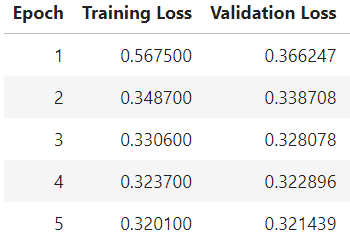

# News-Topic-Classification-Using-Transformer

Approach: Fine Tune only the final layer/ Head of Transformer Model

This approach is often used when the task for which the transformer model is being fine-tuned is different from the task for which it was pre-trained. ie only update the final layer to make predictions for the new task

### About Dataset

The AG's news topic classification dataset is constructed by choosing 4 largest classes from the original corpus. 
Each class contains 30,000 training samples and 1,900 testing samples. The total number of training samples is 120,000 and testing 7,600.

The first column is Class Id, the second column is Title and the third column is Description. \
The class ids are numbered 1-4 where 1 represents World, 2 represents Sports, 3 represents Business and 4 represents Sci/Tech.

### Tokenizer Model - DistilBERT

DistilBER is Transformer model, offers a cost-effective and efficient alternative to BERT base. With 40% fewer parameters and a 60% faster runtime, it maintains over 95% of BERT's performance through distillation.

In our project, we're utilizing the 'distilbert-base-uncased' model. Hence, we employ the tokenizer designed for the DISTILBERT model with the "base" architecture and the "uncased" version.

### Steps followed in this project

1. Read dataset
2. Clean Text data
3. Prepare the Tokenizer
4. Initialize the Model
5. Train the Model
6. Evaluate the Model

### Data Preprocessing

The dataset from Kaggle contains both training and testing samples, eliminating the need for splitting the data into train-test sets. Initially, each sample comprises three columns: Class Id, Title, and Description. As the first preprocessing step, we merged the Title and Description into a new column called 'text', and renamed the 'Class Id' column to 'label'.

Upon examining the class distributions of labels, we found no significant imbalances. Therefore, there's no requirement for any class imbalance processing on the label column, and we can proceed with accuracy as the evaluation metric.

The class ids are represented as follows:

0: World
1: Sports
2: Business
3: Sci/Tech
For training purposes, we opted to utilize only 36,000 samples of data to accommodate 
 
### Prepapre Tokenizer

To prepare the data for input into the Transformer model, we'll convert it into a numerical representation. This involves tokenizing the text into subwords or words, mapping these tokens to integers, and encoding the input as a tensor.

We've opted to utilize DistilBERT, a compact Transformer model derived from BERT base, known for its efficiency and performance. Specifically, we're employing the 'distilbert-base-uncased' model, which is smaller and faster while retaining a significant portion of BERT's performance.

We'll use the tokenizer designed for the DISTILBERT model with the "base" architecture and the "uncased" version, ensuring compatibility with our chosen model architecture.

The from_pretrained() method facilitates the instantiation of the appropriate tokenizer class instance based on the specified model type, in our case, 'distilbert-base-uncased'.

Additionally, we've set the "truncation" argument of the tokenizer to "True", indicating that sequences longer than the maximum length specified by the model will be truncated during tokenization.

### Train the Model

To initiate the training process using DistilBERT as our base model, we start by importing 'distilbert-base-uncased' from the Hugging Face library.

For the fine-tuning approach, we've chosen to freeze all the weights of the pre-trained model and optimize only the weights of the head layers, specifically the 'pre_classifier' and 'classifier' layers. This involves setting layer.trainable = False for each of these layers. The percentage of trainable weights relative to the total weights is set to 0.8%.

Before commencing the training, it's essential to create a mapping of the expected ids to their corresponding labels using dictionaries:

id2label = {0: "World", 1: "Sports", 2: "Business", 3: 'Sci/Tech'}
label2id = {"World": 0, "Sports": 1, "Business": 2, 'Sci/Tech': 3}

The 'AutoModelForSequenceClassification' class from the transformers library is utilized to implement a sequence classification model, which predicts the class of a sequence of inputs, such as a sentence.

'TrainingArguments' is another class that defines the arguments needed to configure a training run, including parameters like the number of training steps, learning rate, batch size, etc. When utilizing the Trainer class, an instance of TrainingArguments is provided to the constructor to specify the configuration for a training run.

##### TrainingArguments:

TrainingArguments set the arguments for training model. The output_dir argument sets the directory where the model and training-related files will be saved. The evaluation_strategy argument sets how often evaluation should be done, and in this case, it's set to be done every epoch.

The save_strategy argument sets when the model should be saved, and it's set to be saved every epoch. The num_train_epochs argument sets the number of training epochs, and it's set to 5. 

The per_device_train_batch_size argument sets the batch size for training, and it's set to 16. The per_device_eval_batch_size argument sets the batch size for evaluation, and it's set to 64.

##### Training:

Defined a function  for evaluation metrics, compute_metrics,that takes a tuple of logits_and_labels as input and computes two evaluation metrics: accuracy. This function first unpacks the tuple into logits and labels. Then it calculates the predictions using np.argmax along the last axis of logits.

The Trainer class takes several arguments:

* training_args is an instance of the TrainingArguments class that contains the arguments for training the model.
* train_dataset is the training dataset
* eval_dataset is the evaluation dataset
* tokenizer is the tokenizer used for the input data
* compute_metrics is the function used to compute the evaluation metrics

###  Evaluate the model

During training, we observed a consistent reduction in both training and validation loss across epochs, indicating that the model's performance improved over time.

The model's accuracy demonstrated notable improvement, advancing from 87% to 89% over the course of five epochs despite the constraints of a limited dataset.

